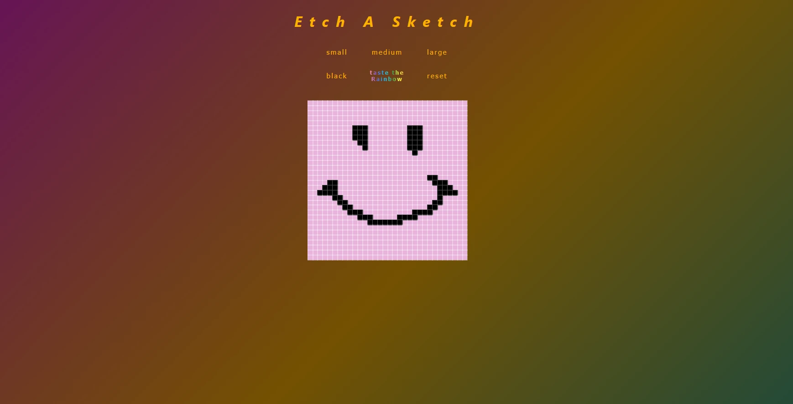

# Etch-a-Sketch

https://github.com/brrrrdy/Etch-a-Sketch

## OVERVIEW

A browser-based 'Etch-a-Sketch' game built as part of The Odin Project curriculum, designed to practise and demonstrate DOM manipulation with vanilla JavaScript.

The core mechanic is a hoverable grid that leaves a pixelated trail as you move your mouse across it — somewhere between an Etch-A-Sketch and a sketchpad.

The grid is generated entirely via JavaScript and can be resized dynamically by the user. 'Extra credit' features include randomised RGB colouring.

## REQUIREMENTS

- Generate a 16x16 grid of square divs via JavaScript (no hardcoded HTML)
- Use Flexbox to lay out the grid
- Hover effect that leaves a coloured trail across the grid
- Button to resize the grid dynamically up to a maximum of 100x100
- Randomised RGB values on each interaction

## BUILT WITH

